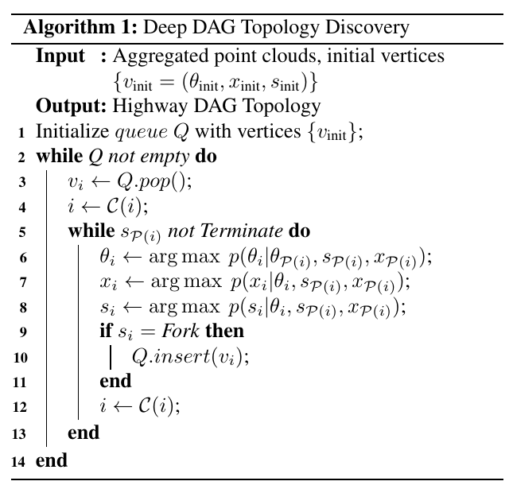

# 车道拓扑

## Paper_1 《DAGMapper: Learning to Map by Discovering Lane Topology》

### 针对的场景

基于lidar的高速车道线拓扑检测（主要难点：分岔与合流）

### 思路
1. 将拓扑检测问题抽象成DAG的最大后验问题，结点间的连接表示因果关系（条件概率）
2. 结点的属性和结点间的条件概率由深度神经网络学习得到

   + 结点的属性
     + 位置 (表示doundary的一个region)
     + 角度（当前结点到下一结点的角度）
     + 状态 (normal, fork, merge, stop)
     + 父结点
     + 子结点
   + 目标函数
     + 

### 核心算法

1. 基于DAG的拓扑探索算法

2. 网络结构
+ Global Feature Network （获取全局特征）
+ Distance Transform Network （提供pixel级别的局部位置信息，提供初始的结点分布，在获取完拓扑关系后绘制道路边界）
+ Direction Header （角度 + 概率）
+ State Header （状态 + 概率）
+ Position Header （region位置 + 概率）

### 效果图

